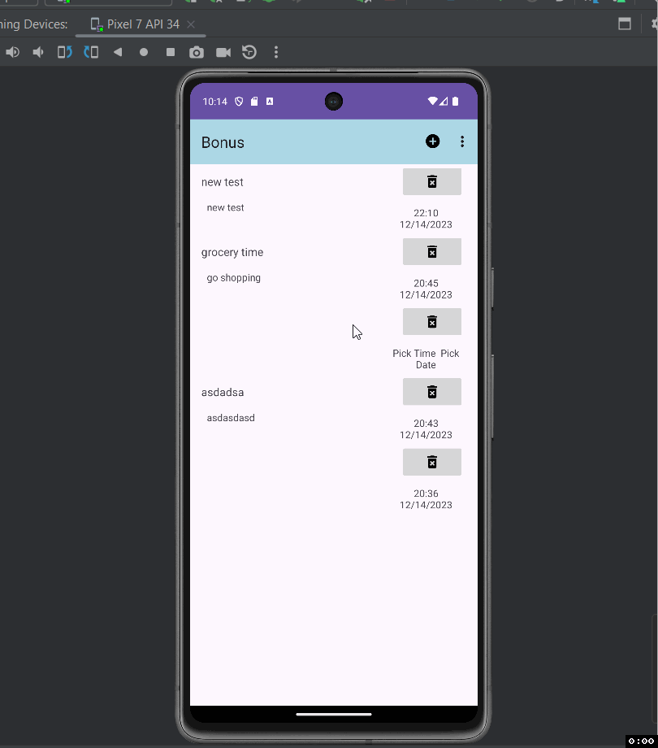

Reminder App

Description of the project ...

- The Project is a reminder application where users can save reminders with title, description, and date.

## Functionality 

The following **required** functionality is completed:

* [ ] Saves into database
* [ ] Display list of reminders in a staggered layout
* [ ] Each reminder should conform to explected format
* [ ] Delete button for reminders should be implemented properly
* [ ] Reminders should be clickable and editable (EditFragment)
* [ ] Menu Items
* [ ] New reminder button should show but others should be in the 3 dots
* [ ] Reminders should be inside a card view
* [ ] Layout is according to requirements
* [ ] Menu Item to delete reminder
* [ ] No Save button, only the back button. Saves into database
* [ ] If user taps existing reminder, the info should be prefilled.
* [ ] Time and date should use picker dialog and should display as the button text after selecting them.

The following **extensions** are implemented: 

Room Persistence Library

## Video Walkthrough

Here's a walkthrough of implemented user stories:

GIF created with [LiceCap](http://www.cockos.com/licecap/).

## License

    Copyright [2023] [Andrew Cheng]

    Licensed under the Apache License, Version 2.0 (the "License");
    you may not use this file except in compliance with the License.
    You may obtain a copy of the License at

        http://www.apache.org/licenses/LICENSE-2.0

    Unless required by applicable law or agreed to in writing, software
    distributed under the License is distributed on an "AS IS" BASIS,
    WITHOUT WARRANTIES OR CONDITIONS OF ANY KIND, either express or implied.
    See the License for the specific language governing permissions and
    limitations under the License.
